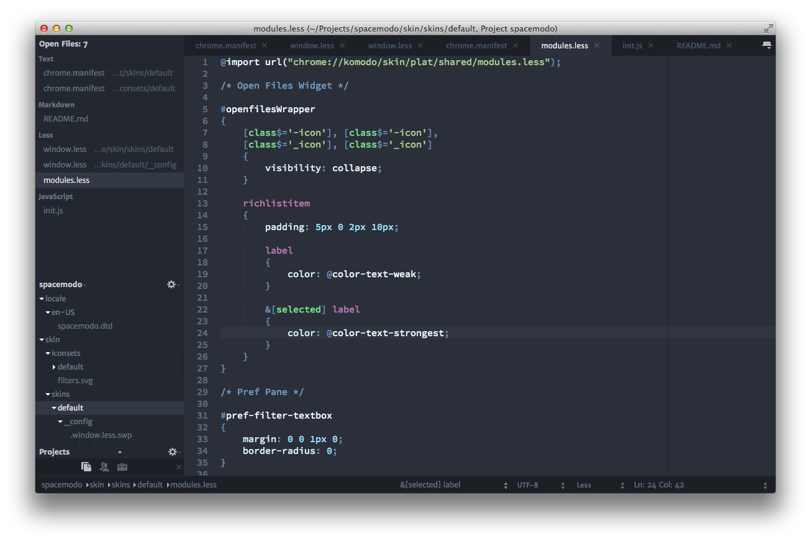

This version is still very experimental and has primarily been tested on OSX.
Linux works for the most part and Windows is completely untested.

This skin is intended to act as a foundation for people to base their skins off
of. At its simplest you'll be able to inherit it's styling and simply tweak the
colors to your liking.

Building
========

To build Spacemodo please refer to the documentation on building an extension:

http://community.activestate.com/forum/introduction-building-komodo-extension

Note that Komodo skins need to be built using the --unjarred flag, ie.

  koext build --unjarred

Once you have built and installed your own version of Spacemodo you can activate it
under Preferences > Appearance > Skin.

Developing
==========

To make development easier you can create a direct link from the installed
addon to your development directory. To do this, create a file named
"spacemodo@activestate.com" under your "<profiledir>/XRE/extensions" directory
and enter the path to your development folder as the file contents of the file,
eg:

    /home/nathan/Projects/Spacemodo
